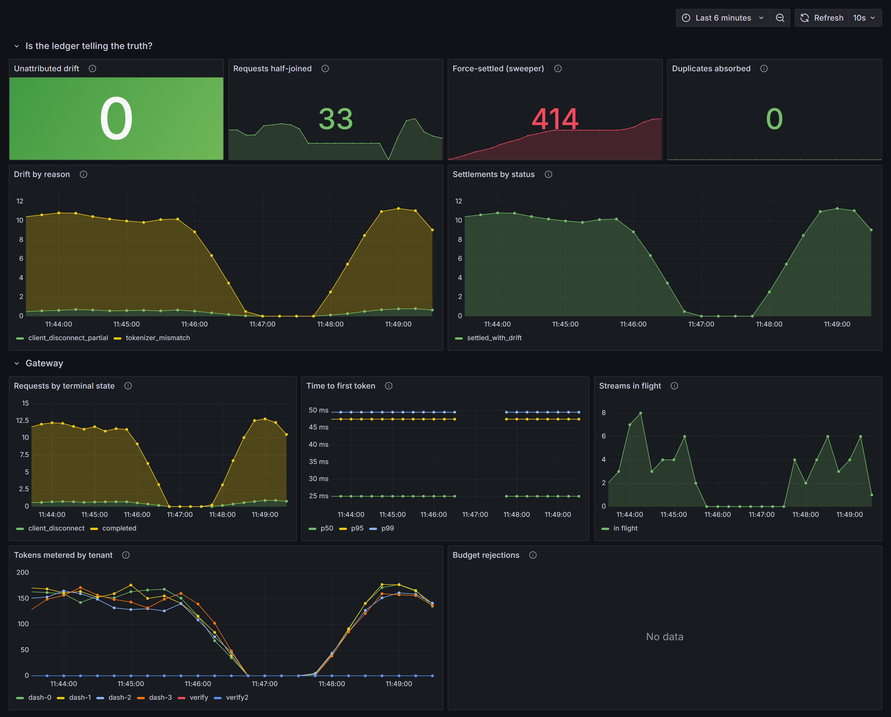
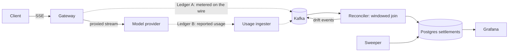

# inference-ledger

An OpenAI-compatible LLM gateway that keeps **two independent token ledgers** and proves they agree.

Every LLM metering tool trusts a single usage number. That number is wrong in exactly the ways
anyone who has worked on payments will recognise: a stream dies at token 800 of 1200, a client
retry double-counts, a pod is evicted mid-response, the provider reports usage that disagrees with
what actually crossed the wire. `inference-ledger` counts tokens off the stream *and* ingests
provider-reported usage on a separate path, joins the two in Kafka, and settles every request with
a reason code when they disagree.

> **Status:** the core system is complete and measured. Gateway, reconciler, sweeper and the chaos
> suite are implemented and tested — 74 unit tests that need no broker, plus
> [9/9 chaos scenarios](#chaos-results) passing against a live deployment. Kubernetes and cloud
> deploy remain; see [Milestones](#milestones). Nothing in this README claims a result that isn't
> reproducible from the repo.



*Live reconciliation dashboard under load, driven against a mock provider deliberately configured to
skew its usage reports. The headline panel — **unattributed drift: 0** — is the invariant that must
hold: every token of disagreement is attributed to a cause (`tokenizer_mismatch` from the injected
skew, `client_disconnect_partial`, `unsettled_timeout` from the sweeper). The dip is the load
generator pausing between runs.*

## Tech stack

- **Gateway** — Python 3.12, FastAPI, httpx (SSE passthrough, no buffering)
- **Event log** — Kafka, via Redpanda in dev (Kafka-wire-compatible, single container)
- **Ledger** — PostgreSQL 17
- **In-flight state** — Redis (idempotency keys, per-tenant token buckets)
- **Observability** — Prometheus + Grafana
- **Orchestration** — Docker Compose for dev, Helm on Kubernetes, Terraform for AWS (EKS + MSK
  Serverless + RDS)

## Architecture



**Ledger A** is counted incrementally as the gateway proxies the stream, so a valid answer exists
after every chunk — including for streams that never finish. **Ledger B** is the provider's own
reported usage, ingested asynchronously so the two ledgers stay genuinely independent. The
reconciler joins them per request and emits a settlement.

Every event is keyed by `request_id`, so both sides of the join always land on the same Kafka
partition. That turns what would be a distributed lookup into per-partition state. Offsets are
committed *after* the Postgres write, and `settlements.request_id` is a primary key — at-least-once
delivery plus an idempotent write is what makes the ledger effectively-once.

When the ledgers disagree, the settlement carries a reason:

| Reason | Meaning |
|---|---|
| `RETRY_DOUBLE_COUNT` | Same idempotency key metered twice — dedup failed |
| `CLIENT_DISCONNECT_PARTIAL` | Client hung up; provider billed tokens we never delivered |
| `BUDGET_TRUNCATED` | We cut the stream on a budget breach |
| `GATEWAY_CRASH_PARTIAL` | Gateway died mid-stream; our count is a floor |
| `TOKENIZER_MISMATCH` | Both ledgers complete, tokenizers disagree |
| `PROVIDER_UNDERREPORT` | Provider billed less than we observed |
| `UNSETTLED_TIMEOUT` | Provider usage never arrived; force-settled on our count |

"Usage is 3% off" is not actionable. "0.4% of streams were truncated by client disconnect and the
provider billed the full completion" is. The reason codes are the point of the project.

**Why this stack.** The design needs an ordered, replayable, partitioned log to join two async
streams and to reconstruct state after a rebalance — that is Kafka's job description, not a queue's.
Redpanda replaces a four-container Confluent stack with one binary so the whole system comes up on a
laptop. Postgres holds settlements because reconciliation output is relational and needs real
constraints. Redis holds only ephemeral state that may be lost on crash. FastAPI is a natural fit
for SSE passthrough where time-to-first-token must not regress.

## Key features

- **Dual-ledger reconciliation** — gateway-metered tokens joined against provider-reported usage in
  a windowed Kafka consumer group, with every disagreement attributed to a cause.
- **Exactly-once settlement under failure** — idempotency-key dedup, post-write offset commits, and
  an idempotent ledger insert, so duplicate delivery and retries cannot double-bill.
- **Mid-stream correctness** — partial streams still settle. Client disconnects, budget cuts and pod
  evictions each produce exactly one attributed ledger entry instead of a hole.
- **Graceful drain of in-flight SSE streams** on `SIGTERM`, with a reserved window for the Kafka
  producer flush. Documented in [docs/shutdown.md](docs/shutdown.md).
- **Chaos suite as the proof** — seven declared failure scenarios (broker partition, `SIGKILL`,
  duplicate delivery, consumer rebalance, usage blackhole) that assert both convergence *and*
  correct attribution. See [chaos/scenarios.py](chaos/scenarios.py).
- **Per-tenant token budgets** enforced at admission and again mid-stream.

## Setup

Requires Docker and Python 3.12+.

```bash
git clone https://github.com/kk10-x/inference-ledger
cd inference-ledger
cp .env.example .env          # set PROVIDER_API_KEY

make up                       # Redpanda, Postgres, Redis, gateway, reconciler, Grafana
```

Point any OpenAI client at `http://localhost:8080/v1`:

```bash
curl -N http://localhost:8080/v1/chat/completions \
  -H 'Content-Type: application/json' \
  -H 'Idempotency-Key: demo-1' \
  -H 'X-Tenant-Id: acme' \
  -d '{"model":"gpt-4o-mini","stream":true,
       "messages":[{"role":"user","content":"Explain exactly-once delivery."}]}'
```

Grafana is at `http://localhost:3000` (anonymous read-only). API docs at `http://localhost:8080/docs`.

All ports bind to `127.0.0.1`. The gateway spends real money against a provider API key, so it is
never exposed to an untrusted network — see [docs/deployment.md](docs/deployment.md) for running
this on a remote host.

```bash
make test     # unit tests — attribution matrix and stream metering
make lint
make load     # Poisson-burst load generator
make chaos    # failure injection; asserts drift converges and is attributed
```

## Chaos results

Nine scenarios, run against a live stack (Redpanda, Postgres, Redis, gateway, reconciler) on a
16GB home server. ~270 requests each at 15 rps with Poisson arrivals, a 30s settlement window, and
the fault injected while streams are in flight.

| Scenario | Reqs | Accounted | Pending | Drift observed |
|---|---:|---:|---:|---|
| baseline | 270 | 100.00% | 0 | none |
| broker-partition | 270 | 100.00% | 0 | none |
| gateway-sigkill | 252 | 100.00% | 0 | 4 × `unsettled_timeout` |
| gateway-sigterm-drain | 245 | 100.00% | 0 | none |
| duplicate-delivery | 271 | 100.00% | 0 | none |
| client-disconnect | 292 | 100.00% | 0 | none (27 disconnects, settled exact) |
| provider-usage-blackhole | 270 | 100.00% | 0 | 195 × `unsettled_timeout` |
| provider-usage-skew | 271 | 100.00% | 0 | 175 × `tokenizer_mismatch`, 700 tokens |
| reconciler-rebalance | 270 | 100.00% | 0 | none |

**What is actually being asserted.** Not "drift went to zero" — drift is *expected* under several of
these faults, and a suite reporting none would only prove it had stopped looking. The invariants
are: every request that started reaches a terminal settlement, every drift token carries a reason
code, and no request is billed twice. A scenario also fails if drift appears that it cannot explain,
so converging *for the wrong reason* is still a failure.

Three results are worth reading closely:

- **`provider-usage-skew`: 175 requests, 700 tokens — exactly 175 × 4**, the injected per-request
  skew, recovered precisely. No infrastructure failed here. This is silent overbilling that a
  single-ledger tool cannot see by construction, because it has nothing to compare against.
- **`gateway-sigterm-drain`: zero drift.** Streams drained, meters finalized, the producer flushed
  inside its reserved window. A rollout costs nothing in billing accuracy.
- **`client-disconnect`: 27 disconnects, zero drift, settled exact.** Because the gateway keeps
  draining the provider stream after the client leaves, both ledgers agree and the disconnect is
  recorded as a terminal state rather than as a discrepancy. Draining *removes* the drift instead of
  attributing it, which is strictly better: you know exactly what you owe.

The `unsettled_timeout` counts are the sweeper doing its job — 195 of them in the blackhole scenario
is the provider-usage feed being switched off entirely, which is the point of that test.

**Reproduce:** `docker compose -f docker-compose.yml -f docker-compose.chaos.yml up -d --build`,
then `python -m chaos.run`. The suite drives a **mock upstream** ([chaos/provider.py](chaos/provider.py))
that can be told to truncate streams, omit usage, or misreport it — a real provider API cannot be
made to fail on demand, and the numbers above are synthetic by construction because of it.

### What the suite found

It was built to produce evidence and instead produced a bug list — which is the more useful outcome:

1. **`CLIENT_DISCONNECT_PARTIAL` was unreachable.** A client hanging up cancelled the response
   generator, which closed the upstream stream, so the provider's usage block — which arrives last —
   was never read. Every disconnect force-settled as `UNSETTLED_TIMEOUT`, and the gateway could not
   distinguish "the client left" from "the provider never reported". The provider stream now outlives
   the client connection.
2. **`SIGKILL` could make requests vanish.** `requests.started` went to a buffering producer while
   response headers returned immediately; a hard kill inside that window destroyed the event, leaving
   no pending row and therefore no way for the sweeper to know the request had existed. Now flushed
   before the first byte.
3. **The sweeper raced its own consumer.** It force-settled on elapsed time without checking whether
   it had read the log — a backlog is indistinguishable from a provider that never reported. Now
   gated on zero consumer lag, with batched offset commits (the synchronous per-message commit was
   causing the lag).
4. **No retry on stale upstream connections.** Any upstream restart leaves dead keepalive
   connections in the pool. The gateway now retries once, but *only before the first token* — after
   that a retry would bill the prefix twice.

Three harness defects were fixed alongside them, all of which had been making results look better
than they were; the commit history has the details.

## Milestones

- [x] Event model and settlement state machine
- [x] Attribution logic with the full drift matrix, unit-tested
- [x] Incremental stream metering (Ledger A), unit-tested
- [x] Gateway HTTP surface: SSE passthrough, idempotency, budgets — 38 tests, no broker required
- [x] Reconciler consumer loop, stateful joiner and sweeper — full loop verified against a live
      Redpanda + Postgres deployment (clean / drift / force-settle all land correctly)
- [x] Chaos runner and load generator — 9/9 scenarios passing, numbers above
- [ ] Grafana dashboard screenshot in `assets/` (dashboard is provisioned; image pending)
- [ ] Helm chart, kind setup, graceful-drain verification
- [ ] Terraform for EKS + MSK Serverless + RDS

## Why I built this

I spent three years building distributed backend systems and now work hands-on with payments
infrastructure, where reconciliation, idempotency and retry semantics are the daily problem. Those
are the same problems LLM serving has just started to hit, and mostly hasn't solved — the existing
gateways all trust one usage number. This is that payments discipline applied to inference, and an
excuse to work through Kafka's delivery semantics properly rather than treating it as a queue.

## License

MIT
