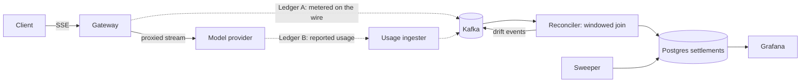

# inference-ledger

An OpenAI-compatible LLM gateway that keeps **two independent token ledgers** and proves they agree.

Every LLM metering tool trusts a single usage number. That number is wrong in exactly the ways
anyone who has worked on payments will recognise: a stream dies at token 800 of 1200, a client
retry double-counts, a pod is evicted mid-response, the provider reports usage that disagrees with
what actually crossed the wire. `inference-ledger` counts tokens off the stream *and* ingests
provider-reported usage on a separate path, joins the two in Kafka, and settles every request with
a reason code when they disagree.

> **Status:** active build. The event model, attribution logic and stream metering are implemented
> and tested; the Kafka consumer loop, gateway HTTP surface and chaos runner are in progress. See
> [Milestones](#milestones). Nothing in this README claims a result that isn't in the repo.

## Tech stack

- **Gateway** — Python 3.12, FastAPI, httpx (SSE passthrough, no buffering)
- **Event log** — Kafka, via Redpanda in dev (Kafka-wire-compatible, single container)
- **Ledger** — PostgreSQL 17
- **In-flight state** — Redis (idempotency keys, per-tenant token buckets)
- **Observability** — Prometheus + Grafana
- **Orchestration** — Docker Compose for dev, Helm on Kubernetes, Terraform for AWS (EKS + MSK
  Serverless + RDS)

## Architecture



**Ledger A** is counted incrementally as the gateway proxies the stream, so a valid answer exists
after every chunk — including for streams that never finish. **Ledger B** is the provider's own
reported usage, ingested asynchronously so the two ledgers stay genuinely independent. The
reconciler joins them per request and emits a settlement.

Every event is keyed by `request_id`, so both sides of the join always land on the same Kafka
partition. That turns what would be a distributed lookup into per-partition state. Offsets are
committed *after* the Postgres write, and `settlements.request_id` is a primary key — at-least-once
delivery plus an idempotent write is what makes the ledger effectively-once.

When the ledgers disagree, the settlement carries a reason:

| Reason | Meaning |
|---|---|
| `RETRY_DOUBLE_COUNT` | Same idempotency key metered twice — dedup failed |
| `CLIENT_DISCONNECT_PARTIAL` | Client hung up; provider billed tokens we never delivered |
| `BUDGET_TRUNCATED` | We cut the stream on a budget breach |
| `GATEWAY_CRASH_PARTIAL` | Gateway died mid-stream; our count is a floor |
| `TOKENIZER_MISMATCH` | Both ledgers complete, tokenizers disagree |
| `PROVIDER_UNDERREPORT` | Provider billed less than we observed |
| `UNSETTLED_TIMEOUT` | Provider usage never arrived; force-settled on our count |

"Usage is 3% off" is not actionable. "0.4% of streams were truncated by client disconnect and the
provider billed the full completion" is. The reason codes are the point of the project.

**Why this stack.** The design needs an ordered, replayable, partitioned log to join two async
streams and to reconstruct state after a rebalance — that is Kafka's job description, not a queue's.
Redpanda replaces a four-container Confluent stack with one binary so the whole system comes up on a
laptop. Postgres holds settlements because reconciliation output is relational and needs real
constraints. Redis holds only ephemeral state that may be lost on crash. FastAPI is a natural fit
for SSE passthrough where time-to-first-token must not regress.

## Key features

- **Dual-ledger reconciliation** — gateway-metered tokens joined against provider-reported usage in
  a windowed Kafka consumer group, with every disagreement attributed to a cause.
- **Exactly-once settlement under failure** — idempotency-key dedup, post-write offset commits, and
  an idempotent ledger insert, so duplicate delivery and retries cannot double-bill.
- **Mid-stream correctness** — partial streams still settle. Client disconnects, budget cuts and pod
  evictions each produce exactly one attributed ledger entry instead of a hole.
- **Graceful drain of in-flight SSE streams** on `SIGTERM`, with a reserved window for the Kafka
  producer flush. Documented in [docs/shutdown.md](docs/shutdown.md).
- **Chaos suite as the proof** — seven declared failure scenarios (broker partition, `SIGKILL`,
  duplicate delivery, consumer rebalance, usage blackhole) that assert both convergence *and*
  correct attribution. See [chaos/scenarios.py](chaos/scenarios.py).
- **Per-tenant token budgets** enforced at admission and again mid-stream.

## Setup

Requires Docker and Python 3.12+.

```bash
git clone https://github.com/kk10-x/inference-ledger
cd inference-ledger
cp .env.example .env          # set PROVIDER_API_KEY

make up                       # Redpanda, Postgres, Redis, gateway, reconciler, Grafana
```

Point any OpenAI client at `http://localhost:8080/v1`:

```bash
curl -N http://localhost:8080/v1/chat/completions \
  -H 'Content-Type: application/json' \
  -H 'Idempotency-Key: demo-1' \
  -H 'X-Tenant-Id: acme' \
  -d '{"model":"gpt-4o-mini","stream":true,
       "messages":[{"role":"user","content":"Explain exactly-once delivery."}]}'
```

Grafana is at `http://localhost:3000` (anonymous admin). API docs at `http://localhost:8080/docs`.

```bash
make test     # unit tests — attribution matrix and stream metering
make lint
make load     # Poisson-burst load generator
make chaos    # failure injection; asserts drift converges and is attributed
```

## Milestones

- [x] Event model and settlement state machine
- [x] Attribution logic with the full drift matrix, unit-tested
- [x] Incremental stream metering (Ledger A), unit-tested
- [ ] Gateway HTTP surface: SSE passthrough, idempotency, budgets
- [ ] Reconciler consumer loop and sweeper
- [ ] Chaos runner and load generator; drift-convergence numbers in this README
- [ ] Grafana dashboard + screenshot in `assets/`
- [ ] Helm chart, kind setup, graceful-drain verification
- [ ] Terraform for EKS + MSK Serverless + RDS

## Why I built this

I spent three years building distributed backend systems and now work hands-on with payments
infrastructure, where reconciliation, idempotency and retry semantics are the daily problem. Those
are the same problems LLM serving has just started to hit, and mostly hasn't solved — the existing
gateways all trust one usage number. This is that payments discipline applied to inference, and an
excuse to work through Kafka's delivery semantics properly rather than treating it as a queue.

## License

MIT
